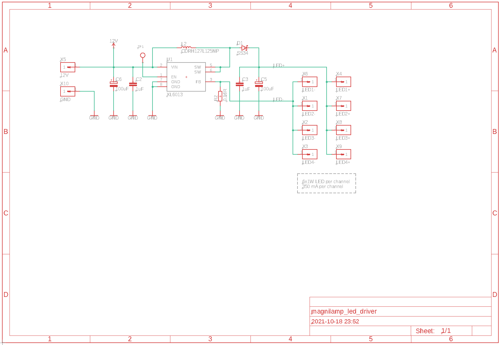
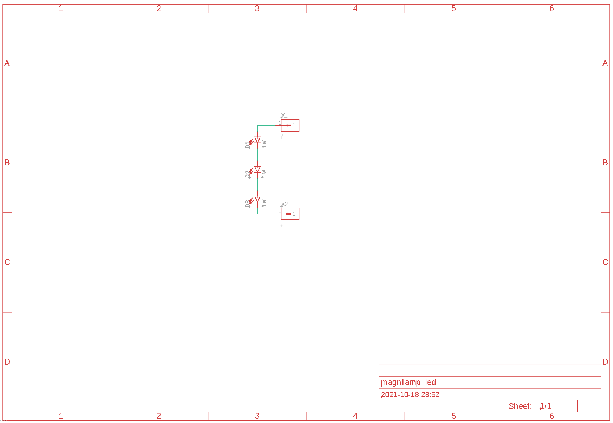
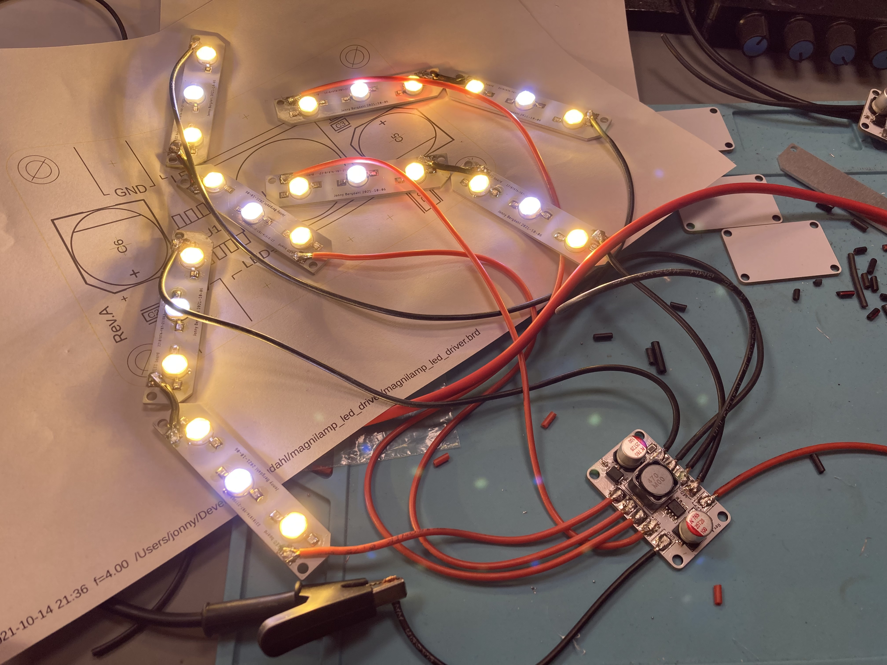
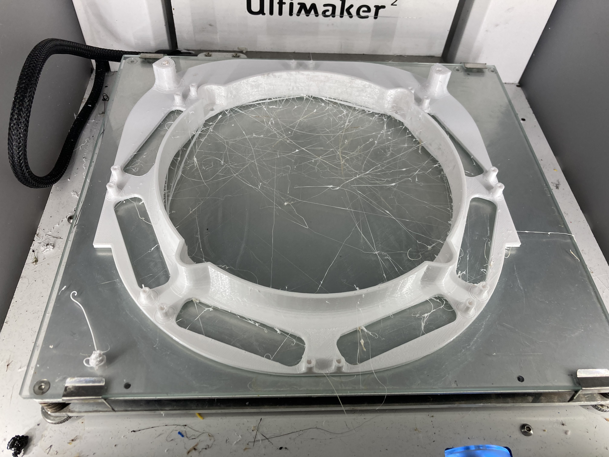
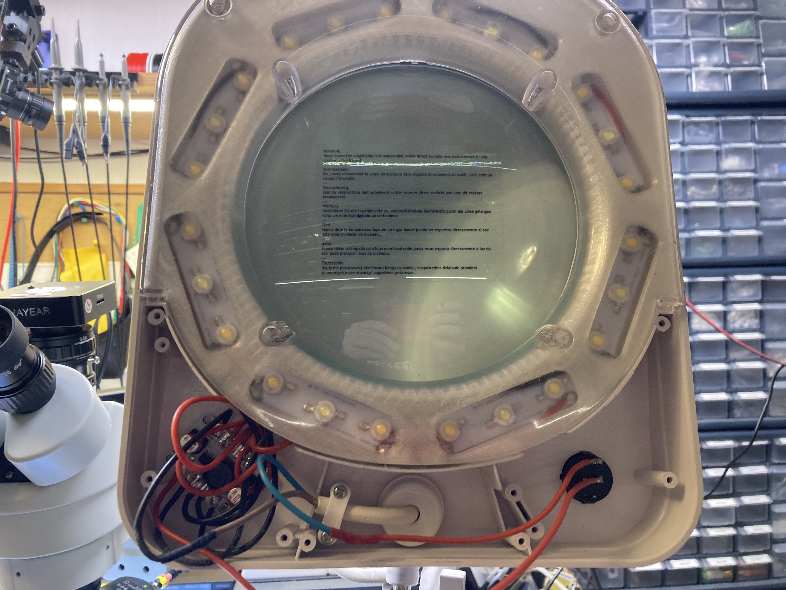
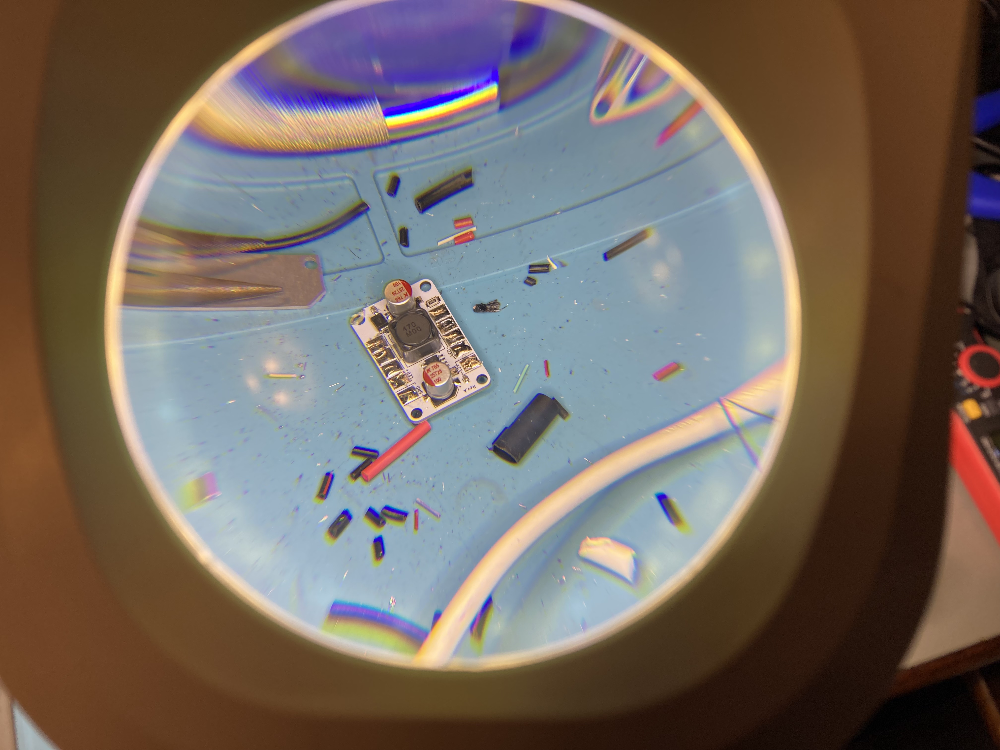

# magnilamp_led_driver

This is a modification of the _VTLLAMP1W_ LED magnifying glass lamp - https://www.velleman.eu/products/view/?id=380108

> Please start this project by cutting off the mains plug so you can't accidently plug it into mains again!

It is powered by 12V and uses a constant current LED driver to drive 24 1W LED's placed on 8 aluminium PCB's.

Gerber files for the PCB's can be found in the Gerber folder, design files for EAGLE can be found in the pcb folder, and design files for Fusion360 for the optional mounting ring can be found in the cad folder.

# LED driver board

The LED driver is based on the XLSEMI XL6013 Boost LED driver. 

# LED board

The LED boards are designed to be drop-in replacement of the orginal LED boards.

# Mounting hardware

I designed a replacement 3D printable mounting ring. If you don't have a 3D printer, you can instead modify the original, and make cutouts for the new LED lighting. 

I tried to use PETG, but it turned out to be too brittle so I ended out printing it in clear PLA instead. Also, I really hate the stringing PETG. In the end it turned out the lamp does not get hot, so PLA is perfectly fine for this.

# Assembly

I am reusing the 240V cable for power, using blue for 12V and brown for GND. I used double sided tape to fasten the LED driver in the lamp. 

The LED PCB's should be soldered together 2 by 2, and the resulting 2 LED "strips" soldered to the LED board.

Finish up by connecting the old mains wires to 12V and GND of the LED driver. 

# Final product.

I actually had to lower the current to the LED's as it was way to bright. I run it at 15W now instead of 24W and my lux meter tells me it outputs 7000 lux. That is plenty bright, and the life time of the LED's will be almost infinite.

